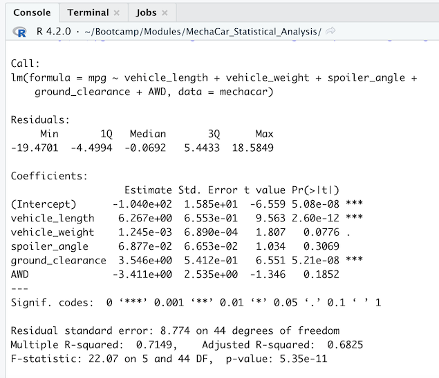
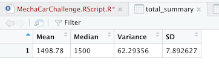
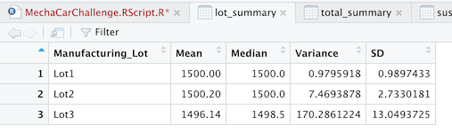
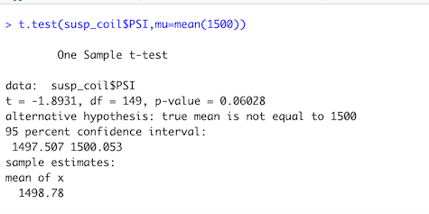
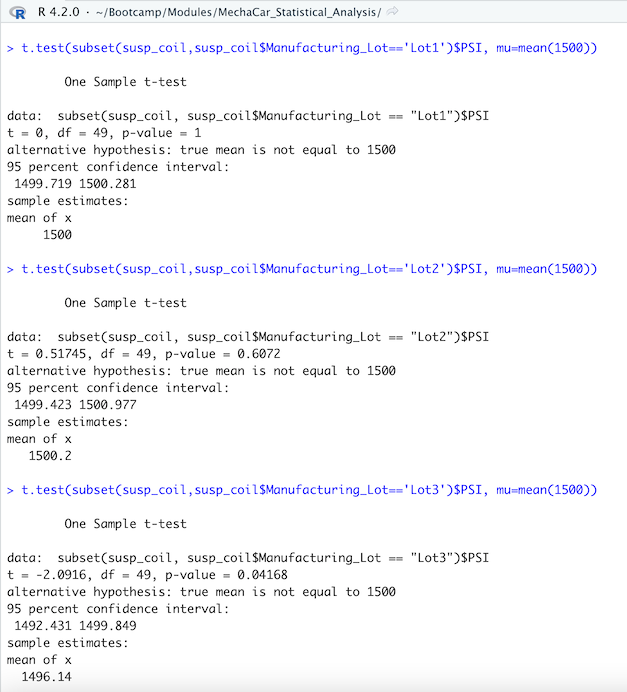

# MechaCar_Statistical_Analysis

## Linear Regression to Predict MPG

- H0 : The slope is zero
- Ha : The slope is not zero
- Significance level: 0.05%

Based on the data, and assuming a significance level of 0.05%, vehicle length, ground clearance, and the intercept contributed non-random amounts of variance to the mpg values in this dataset. The p-values of these variables are below the significance level which means we can reject the hypothesis that their coefficients are zero.

The p-value of the overall model is 5.35 x 10^-11. Therefore, there is sufficient evidence to reject the null hypothesis, which means that the slope of the linear model is not zero.

An R-squared of 0.71 indicates that this linear model does predict mpg of MechaCar prototypes effectively

## Summary Statistics on Suspension Coils

The design specifications for the MechaCar suspension coils dictate that the variance of the suspension coils must not exceed 100 pounds per square inch (PSI). 

The manufacturing data suggests that totaled across all manufacturing lots, the suspension coils meet this design specification because the sample variance is 62 PSI, which is below the 100 threshold.

Summary statistics on all suspension coils:

However, based on the above criteria, lots 1 and 2 meet the design requirement but lot 3 does not.

## T-Tests on Suspension Coils

- H0 : There is no statistical difference between the observed sample mean and its population mean of 1500 PSI
- Ha : There is a statistical difference between the observed sample mean and its population mean of 1500 PSI
- Significance level: 0.05%

Across all manufacturing lots, the p-value of the t-test is 0.06028, which is above our significance level. Therefore, we don't have sufficient evidence to reject H0, and we conclude that the sample mean is not statistically different than 1500.

Repeating the t-test by manufacturing lot,
- Lots 1 and 2 have p-values greater than 0.05; we cannot reject H0 and we conclude that their sample means are not statistically different than 1500
- Lot 3 has a p-value below 0.05; we reject H0 and conclude that its sample mean is statistically different than 1500

